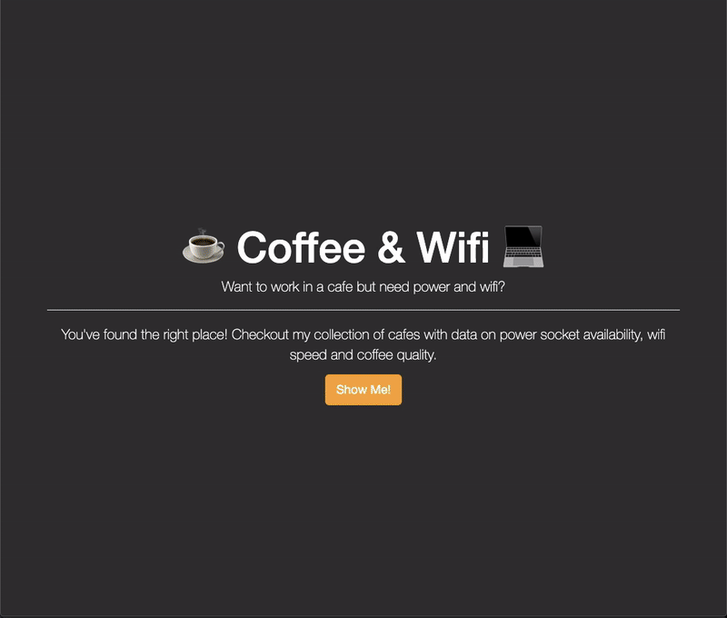

# Day 62 Topics Covered - Coffee & Wifi Project

I practiced concepts from previous lessons in web development (Flask WTForms, Flask Template Inheritance, [Flask-Bootstrap](https://pythonhosted.org/Flask-Bootstrap/basic-usage.html#available-blocks)), by building the bootcamp's "Coffee & Wifi" project. 

## Website Demonstration

