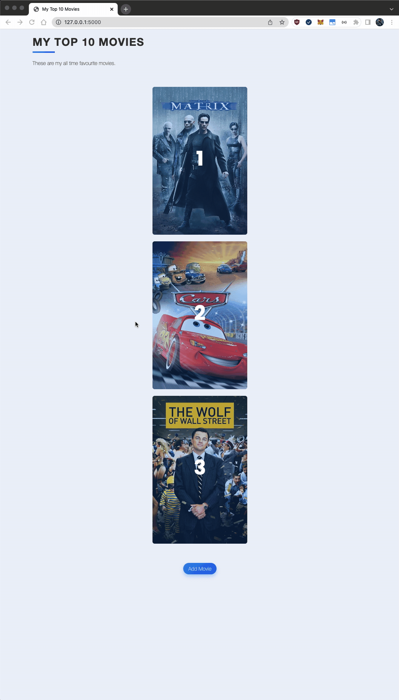
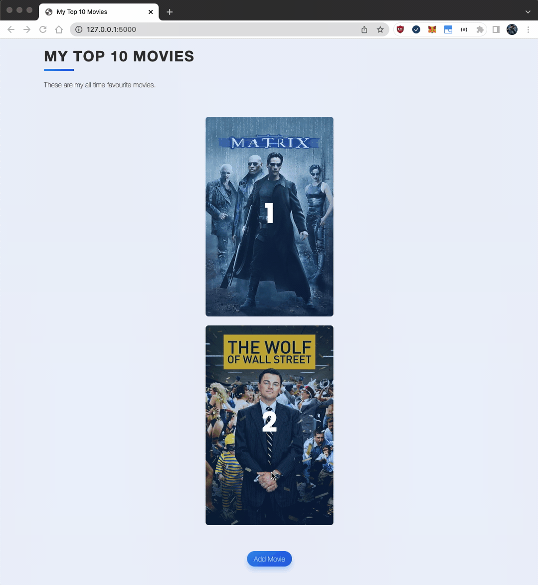
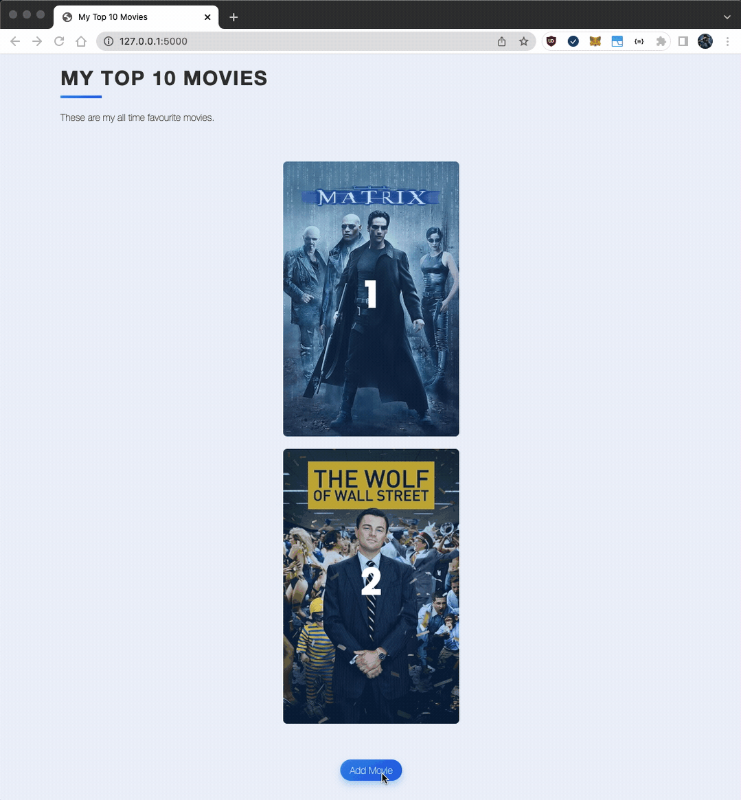

# Day 64 Project - My Top 10 Movies Website

## Notable Features

- This website has been built using full CRUD  
- Movies may be searched for by using [The Movie Database](https://www.themoviedb.org/documentation/api?language=en-US) API integration
- Pagination (WIP)
- The Sqlite database this project contains may be accessed by using SQLAlchemy

## Demonstration 

### Home Page & Delete Movie from Database

### To Edit a Movie

### To Add a Movie

## Local Setup

1. cd into the /movie-project directory

2. Install the package requirements with `pip install -r requirements.txt`

3. Run the Flask application with `python3 server.py`
