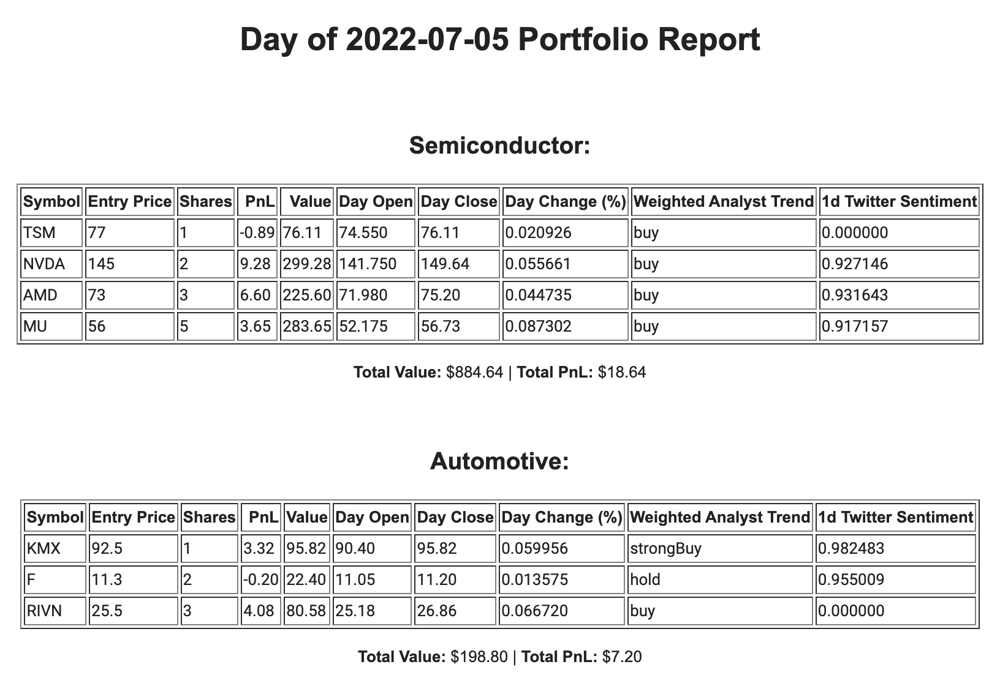

## Day 97 Course Assignment: A Custom Automation Project

_Automate some part of your life_

I created Python software that sends a report to the specified email regarding the performance of the stocks in the theoretical portfolio(s) at the end of every NYSE trading day.

This report adds the following datapoints for each stock using the [Finnhub API](https://finnhub.io/):
- **Position PnL**
- **Position Value**
- **Day Open**
- **Day Close**
- **Day Change (% expressed as a decimal)**
- **Highest Weighted Analyst Trend (buy, strong buy, hold, etc.)**
- **Social Sentiment (Twitter Only -1 to 1, -1 being very negative and 1 being very positive)**

Upon initial startup of the bot, it to loads up [an excel workbook](./data/) containing three columns, "Symbol", "Entry Price", and "Shares". Each sheet in the workbook should contain these three columns, and each sheet is treated as a unique theoretical portfolio.

The task is run on a scheduler that fetches all NYSE trading day closing times a year out from the script run date.
The thread sleeps until a trading close date is satisfied, when the report is built and sent.
___
### Local Setup:
1. Install package requirements: `pip install -r requirements.txt`
2. Configure your local configuration in [_config.py](portfolio_report/_config.py):
   1. Set your SMTP configuration
   2. Specify your finnhub rate limit (default is free subscription)
3. Set required environment variables (.env file supported in root dir):
   ```bash
   FINNHUB_APIKEY=your_finnhub_apikey
   FROM_EMAIL=your_sender_email
   FROM_EMAIL_PASSWORD=your_sender_email_password
   ```
4. Modify the "INPUT_FILEPATH" and "RECIPIENT_EMAILS" variables in [main.py](main.py)
5. Run the script from the root directory:
   ```bash
   python main.py
   ```
___
### Email Report Demo:

